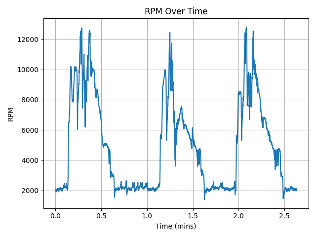
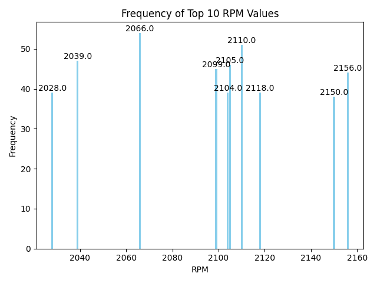

Onboarding Project: Data Analysis

Author: Alexander Ezigbo

Date: February 15, 2026

Project Overview:

This project demonstrates basic data analysis through the use of the pandas and matplotlib libraries.
The main goals of this project were:
    1. Convert the timestamps into a more readable format
    2. Visualize how the RPM of the car changes over time
    3. Identify and Visualize the top 10 most frequent RPM values

Code Explanation:

    import pandas as pd
    import matplotlib.pyplot as plt

    # Load CSV
    df = pd.read_csv("can_data.csv")

In the first part of my code, I first imported the pandas and matplotlib libraries. I imported the can_data.csv using
the pd.read_csv() method and assigned it to the variable "df".

    # Convert the timestamps into a more readable format
    t0 = df["timestamp"].iloc[0]
    df["time (sec)"] = (df["timestamp"] - t0)
    df.drop(columns=["timestamp"], inplace=True)

    # Reorder the data to move the new column to the front of the data file
    new_column = df.pop("time (sec)")
    df.insert(0, "time (sec)", new_column)

Next I began the first task of the code, which was to clean up the timestamp column and create a more readable time column.
I first had to find the first timestamp in the column and assigned it to the variable "t0". Then I created a new
Series inside the "df" titled "time (sec)" that contained each timestamp with t0 subtracted. This converted all timestamps
into seconds relative to the first reading. Once this was done I dropped the timestamp column and reordered the new column
to be the first in the data file.

    # Graph #1: Plotting the RPM Over Time
    time_in_minutes = df["time (sec)"] / 60

    plt.figure()

    plt.plot(time_in_minutes ,df["RPM"])

    plt.title("RPM Over Time")
    plt.ylabel("RPM")
    plt.xlabel("Time (mins)")

    plt.grid(True)
    plt.yscale("linear")
    plt.xscale("linear")
    plt.tight_layout()

    plt.show()

Next it was graphing the RPM over time using the new time (secs) column. I first converted
the timestamps into minutes then, using the features from the matplotlib, I was able to
generate a graph that visualized the changes of the RPM over time in minutes.

    # Count how many times each unique number appears
    counts = df["RPM"].value_counts().sort_index()

    # Create a new series containing the top 10 most frequent RPM values
    top_10_counts = counts.sort_values(ascending=False)[:10]

Afterward it was finding the top 10 most frequent RPM values. To do this I used the value_counts() method to
get the count of each value in the Series, and sorted them. I then assigned these values into the variable "count".
Then I created a new variable called "top_10_counts", which I assigned to it the top 10 values in descending order.

    plt.figure()

    bars = plt.bar(top_10_counts.index, top_10_counts.values, color="skyblue")

    # Add a text above each bar the contains the RPM value
    for bar, x_val in zip(bars, top_10_counts.index):
        height = bar.get_height()
        plt.text(
            bar.get_x() + bar.get_width() / 2,
            height,
            f"{x_val}",
            ha="center",
            va="bottom"
        )

    # Plot the RPM Values
    plt.xlabel("RPM")
    plt.ylabel("Frequency")
    plt.title("Frequency of Top 10 RPM Values")
    plt.tight_layout()
    plt.show()

For this graph I used a Bar Graph, and added text above each bar to show the exact values that the RPM most frequently
reached.

Conclusions:

From the two graphs created I concluded the following: The RPM shows a cyclical pattern, rising and falling in short intervals,
indicating regular fluctuations it's operation, and the vehicle most frequently reached 2066.0 RPM.

